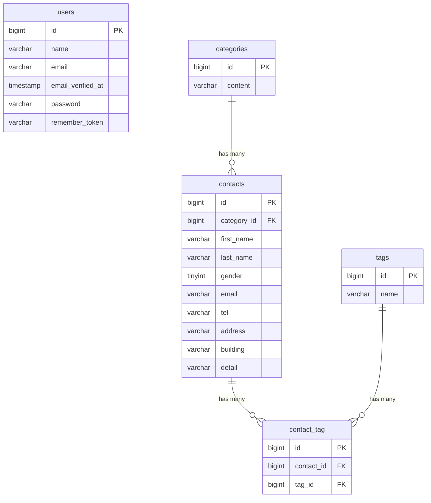

# COACHTECH お問い合わせフォーム

一般ユーザー向けのお問い合わせフォームと、管理者向け管理機能を提供するWebアプリケーションです。

## 概要

ユーザーはお問い合わせ内容を入力・送信することができ、
管理者はログイン後、お問い合わせ内容の確認・検索・削除・CSVエクスポートを行うことができます。

また、カテゴリ・タグ管理機能、REST API、お問い合わせデータのバリデーション、
PHPUnitによるテストを実装しています。

## 作成者

溝口　竣介

## 使用技術

- PHP 8.x
- Laravel 10.x
- MySQL 8.x
- Nginx
- Vite
- Tailwind CSS 3.4.x
- Docker / Laravel Sail
- phpMyAdmin
- PHPUnit 10.x
- Git / GitHub

## ER図



## 開発環境URL

http://localhost

## 動作環境

本アプリケーションは**Docker（Laravel Sail）**を利用して動作します。

## 環境構築手順

1. **リポジトリをクローン**

    リポジトリをクローンします。
    ```bash
    git clone git@github.com:shunsukem1993-a11y/contact-form-app.git
    ```
    クローンしたプロジェクトディレクトリに移動します。
    ```bash
    cd contact-form-app
    ```

2. **.envファイルの準備**
    
    .env.exampleをコピーして.envファイルを作成します。
    ```bash
    cp .env.example .env
    ```

    .envのデータベース設定が以下になっていることを確認してください。

    ```env
    DB_CONNECTION=mysql
    DB_HOST=mysql
    DB_PORT=3306
    DB_DATABASE=laravel
    DB_USERNAME=sail
    DB_PASSWORD=password

3. **Composer依存パッケージのインストール**

    コンテナを起動します。
    ```bash
    docker compose up -d
    ```
    Laravelコンテナ内でComposerを実行し、Composerで依存パッケージをインストールします。
    ```bash
    docker run --rm \
    -u "$(id -u):$(id -g)" \
    -v "$(pwd):/var/www/html" \
    -w /var/www/html \
    -e COMPOSER_CACHE_DIR=/tmp/composer_cache \
    laravelsail/php82-composer:latest \
    composer install --ignore-platform-reqs
    ```
    コンテナを停止します。
    ```bash
    docker compose down
    ```

4. **Laravel Sailの起動**

    Dockerコンテナを起動します。
    ```bash
    ./vendor/bin/sail up -d
    ```

5. **アプリケーションキーの生成**

    Laravelのアプリケーションキーを生成します。
    ```bash
    ./vendor/bin/sail artisan key:generate
    ```

6. **データベースのマイグレーションと初期データ投入**

    テーブルを作成し、必要に応じてシーダーを実行します。
    ```bash
    ./vendor/bin/sail artisan migrate --seed
    ```
    ※シーダーを使用していない場合は、以下を実行してください。
    ```bash
    ./vendor/bin/sail artisan migrate
    ```

7. **フロントエンドのビルド**

    Node.jsの依存パッケージをインストールし、開発用ビルドを実行します。
    ```bash
    ./vendor/bin/sail npm install
    ./vendor/bin/sail npm run dev
    ```

8. **アプリケーションへのアクセス**

    ブラウザで以下のURLにアクセスします。
    ```bash
    http://localhost
    ```

## テスト実行

PHPUnitによるテストを実行する場合は、以下のコマンドを実行してください。
```bash
./vendor/bin/sail test
```

特定のテストファイルのみを実行する場合は、以下のように指定できます。

- AdminControllerTest.phpを実行
```bash
./vendor/bin/sail test tests/Feature/AdminControllerTest.php
```

- AuthenticationTest.phpを実行
```bash
./vendor/bin/sail test tests/Feature/AuthenticationTest.php
```

- ContactControllerTest.phpを実行
```bash
./vendor/bin/sail test tests/Feature/ContactControllerTest.php
```

- ContactRelationTest.phpを実行
```bash
./vendor/bin/sail test tests/Feature/ContactRelationTest.php
```

- ContactValidationTest.phpを実行
```bash
./vendor/bin/sail test tests/Feature/ContactValidationTest.php
```

- ExportContactTest.phpを実行
```bash
./vendor/bin/sail test tests/Feature/ExportContactTest.php
```

- tests/Feature/TagControllerTest.phpを実行
```bash
./vendor/bin/sail test tests/Feature/TagControllerTest.php
```

- ContactApiTest.phpを実行
```bash
./vendor/bin/sail test tests/Feature/Api/V1/ContactApiTest.php
```

- IndexContactRequestTest.phpを実行
```bash
./vendor/bin/sail test tests/Unit/Requests/Api/V1/IndexContactRequestTest.php
```

- StoreContactRequestTest.phpを実行
```bash
./vendor/bin/sail test tests/Unit/Requests/Api/V1/StoreContactRequestTest.php
```

## 機能一覧

- お問い合わせフォーム入力機能
- お問い合わせ確認画面表示機能
- お問い合わせ送信機能
- サンクスページ表示機能
- 管理者登録機能
- ログイン・ログアウト機能
- 認証機能（Laravel Fortify）
- お問い合わせ一覧表示機能
- お問い合わせ詳細表示機能
- お問い合わせ削除機能
- お問い合わせ検索機能
  - キーワード検索（氏名・メール）
  - 性別検索
  - カテゴリ検索
  - 日付検索
- CSVエクスポート機能
- カテゴリ管理機能
  - カテゴリ設定機能
- タグ管理機能
  - タグ追加機能
  - タグ編集機能
  - タグ更新機能
  - タグ削除機能
- バリデーション機能（FormRequest）
- API機能（REST API）
  - お問い合わせ一覧取得API
  - お問い合わせ詳細取得API
  - お問い合わせ作成API
  - お問い合わせ更新API
  - お問い合わせ削除API
- データベースリレーション機能
  - CategoryとContactの1対多リレーション
  - ContactとTagの多対多リレーション
- 認可機能（Middleware）
- PHPUnitによるテスト

## APIエンドポイント一覧

本アプリケーションで提供している主なREST APIの一覧です。

お問い合わせAPI

| HTTPメソッド | URI | 概要 |
|--------------|-----|------|
| GET | /api/v1/contacts | お問い合わせ一覧を取得（検索・ページネーション対応） |
| GET | /api/v1/contacts/{contact} | お問い合わせ詳細を取得（カテゴリ・タグ情報を含む） |
| POST | /api/v1/contacts | お問い合わせを新規作成 |
| PUT | /api/v1/contacts/{contact} | お問い合わせを更新 |
| DELETE | /api/v1/contacts/{contact} | お問い合わせを削除 |